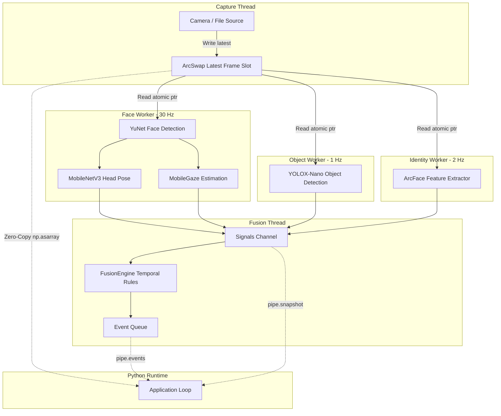

# Architecture overview

`vigilo-stream` provides a high-throughput, low-latency pipeline by decoupling camera capture, neural inference workers, and temporal rule evaluation into dedicated, lock-free threads.

## Thread topology

## Key design decisions

### 1. Lock-free frame exchange (`ArcSwap`)
Rather than passing frames through unbounded bounded channels where slow workers can cause queue latency buildup, the capture thread atomically swaps the newest frame into an `ArcSwap<Option<Arc<Frame>>>` slot.

Workers read the latest pointer atomically without locks. If a worker is busy processing a previous frame, it simply reads the newest available frame on its next iteration, naturally dropping intermediate frames without lag.

### 2. Cadence separation
Running YOLOX-Nano on every frame would consume excessive CPU cycles and increase latency variance. Because prohibited objects (e.g. phones or books) typically remain in view for several seconds, running the object detector at 1 Hz provides reliable detection while freeing 95% of inference cycles for smooth 30 Hz face and gaze tracking.

### 3. Separation of inference and fusion
Neural network models produce raw, level-triggered detections. Deciding whether those detections constitute a proctoring violation belongs exclusively to the temporal fusion engine. This clean boundary ensures that:
- Detection models remain stateless.
- Rules, hold timers, and score accumulators are configured in one central place.
- Sessions can be recorded as raw signal logs and replayed deterministically offline.
