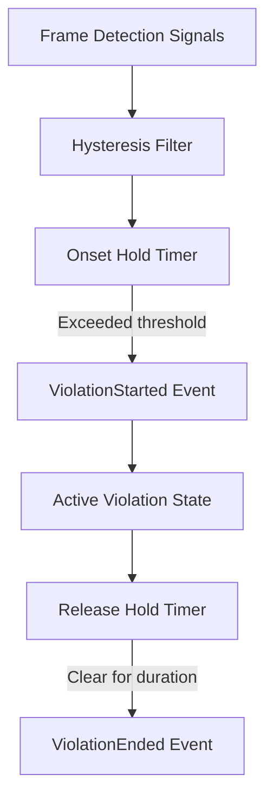

# Fusion engine & replay

The `FusionEngine` converts raw, noisy per-frame neural network detections into stable, actionable temporal violations. It runs deterministically with no camera or GPU dependencies, making it suitable for offline session auditing, automated grading, and unit testing.

## Why raw detections are insufficient

Proctoring algorithms cannot rely on instantaneous detections alone:

- **Detection jitter**: A detector may miss a face for a single frame due to motion blur or lighting. Marking a violation for a 33 ms drop causes false positives.
- **Micro-movements**: Natural eye saccades and brief head tilts to look at a keyboard should not immediately flag candidate cheating.
- **Hysteresis necessity**: Entering a violation state should require sustained evidence (onset hold), and clearing it should require sustained absence of the violation (release hold).

## Fusion mechanics



### Hysteresis and hold timers
- **Onset hold timer**: The duration in milliseconds that a condition must continuously persist before a `ViolationStarted` event is emitted.
- **Release hold timer**: The duration that the condition must remain cleared before a `ViolationEnded` event is emitted.
- **Score accumulators**: Weight-based suspicion accumulation that builds up over recurring minor infractions.

## Headless single-frame stepping

You can feed custom signals into the engine frame by frame:

```python
import vigilo_stream

engine = vigilo_stream.FusionEngine()

# Construct synthetic signals for frame sequence
bbox = vigilo_stream.BBox(x=100.0, y=100.0, w=200.0, h=200.0)
face = vigilo_stream.FaceDetection(bbox=bbox, score=0.98)
pose = vigilo_stream.HeadPose(yaw_deg=45.0, pitch_deg=0.0, roll_deg=0.0)  # Head turned away

signals = vigilo_stream.Signals(
    seq=1,
    t_ms=1000,
    faces=[face],
    head_pose=pose,
    gaze=None,
    objects=[],
    identity_match=None,
)

# Step the engine with signals
events = engine.step(signals)
for event in events:
    print(f"Frame 1 produced: {event}")
```

## Deterministic session replay

During an exam, signals can be logged to a `.jsonl` file. The entire session can later be replayed offline through `engine.replay()`:

```python
import vigilo_stream

engine = vigilo_stream.FusionEngine()

# Replay an entire recorded session from disk
events = engine.replay("recorded_exam_session.jsonl")

print(f"Replay evaluated {len(events)} discrete violation events.")
for ev in events:
    if ev.event_type == "ViolationStarted":
        v = ev.violation
        print(f"Violation: {v.kind} (severity: {v.severity}) started at {v.t_start_ms}ms")
```

### Determinism guarantee
Given the identical JSONL sequence of signals and the same configuration TOML, `FusionEngine.replay()` produces the exact same event timeline down to the millisecond.
