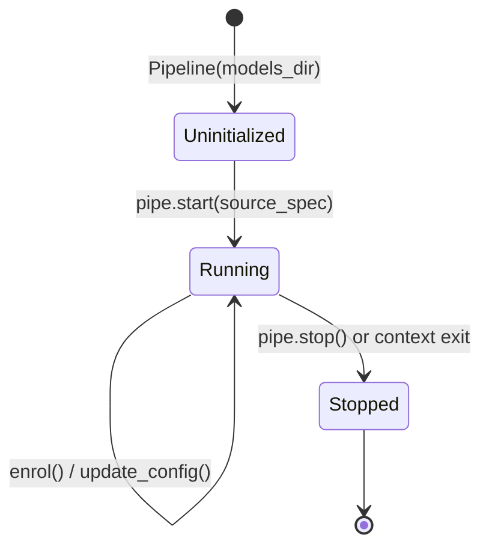

# Pipeline lifecycle

The `Pipeline` class manages the lifecycle of hardware video capture, worker thread pools, neural inference, and temporal event generation.

## Lifecycle overview



## Video sources

`pipe.start(source_spec)` accepts three types of input:

1. **Webcam capture**:
   ```python
   pipe.start("camera:0")  # Default camera
   pipe.start("camera:1")  # Secondary webcam
   ```
2. **Video file playback**:
   ```python
   pipe.start("file:tests/fixtures/sample_exam.mp4")
   ```
3. **Image sequence directory**:
   ```python
   pipe.start("dir:frames_dump/")
   ```

## Polling vs events

The pipeline provides two distinct query mechanisms:

### 1. Instantaneous signals (`snapshot()`)
`pipe.snapshot()` returns a `Signals` object containing the raw, unfiltered detections from the most recent frame:
- Detected faces with bounding boxes and 5 facial keypoints.
- Head pose Euler angles (yaw, pitch, roll).
- Gaze direction vectors (yaw, pitch).
- Detected prohibited objects (phones, laptops, books).

`snapshot()` is level-triggered and non-blocking. It returns `None` if no frame has been processed yet.

### 2. Discrete violation events (`events()`)
`pipe.events()` drains all new temporal events evaluated by the `FusionEngine` since the last call:
- `ViolationStarted`: A condition (e.g. `head_turned_away`) has persisted past its configured onset hold timer.
- `ViolationEnded`: The condition has ceased and cleared its release hold timer.
- `CalibrationProgress` / `CalibrationComplete`: Head and gaze calibration progress.
- `Degraded` / `Recovered`: Performance drops or recovery alerts.

## Context manager pattern

Using Python's `with` statement ensures threads and camera resources are released cleanly even if an unhandled exception occurs:

```python
import vigilo_stream

with vigilo_stream.Pipeline(models_dir="models") as pipe:
    pipe.start("camera:0")

    while pipe.is_running():
        frame = pipe.poll_frame()
        # Processing loop...
# Hardware capture and background threads are stopped automatically on exit
```

## Face identity enrollment

To verify that the candidate sitting for the exam is the same person throughout the session, call `pipe.enrol()`:

```python
# Request enrollment on the next clear face detection
pipe.enrol()

# Check enrollment status
if pipe.is_enrolled():
    print("Candidate face enrolled successfully.")
```

Once enrolled, the ArcFace identity worker compares subsequent frames against the enrolled feature embedding and produces `identity_match` similarity scores.

## Hot-reloading configuration

You can update detection thresholds, hysteresis limits, and hold timers at runtime without restarting capture:

```python
new_config_toml = """
[models.face]
score_threshold = 0.85

[fusion.head_pose]
yaw_threshold_deg = 25.0
onset_hold_ms = 800
"""

pipe.update_config(new_config_toml)
```
