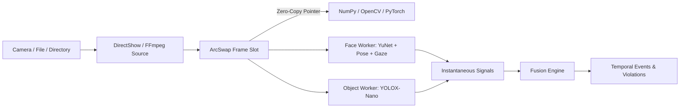

# What is vigilo-stream?

`vigilo-stream` is a Python library built on top of the [`vigilo-core`](https://github.com/Abdullah-Masood-05/vigilo-core) Rust engine. It provides zero-copy video frame sharing, multi-threaded neural network inference, and deterministic temporal stream fusion for computer vision and proctoring applications.

## The problem with Python vision pipelines

Most Python vision systems suffer from three common issues:

1. **Memory copy overhead**: Passing image buffers between C/C++ capture backends, Python, NumPy, and inference runtimes often involves multiple `memcpy` operations per frame. At 1080p or 4K resolutions, copying 30 to 60 frames every second burns memory bandwidth and spikes latency.
2. **Global Interpreter Lock (GIL) contention**: Running video capture, decoding, and multiple deep learning models inside Python worker threads causes thread starvation and frame drops due to GIL contention.
3. **Flickering and unstable alerts**: Raw neural network detections fluctuate frame to frame. A candidate turning their head for two video frames should not trigger an immediate violation. Without temporal smoothing, hold timers, and hysteresis, proctoring systems produce noisy, uncalibrated alerts.

## How vigilo-stream solves this

### 1. Zero-copy buffer protocol
Frame buffers allocated by the Rust capture backend are exposed directly to Python through `__array_interface__` and the Python buffer protocol. When you call `np.asarray(frame)`, NumPy references the existing memory address without copying a single byte.

### 2. Lock-free frame exchange
Capture threads write to atomic `ArcSwap` slots. Processing workers read the latest frame without mutex contention. If inference takes longer than the capture interval, stale frames are discarded automatically instead of queueing up and causing latency buildup.

### 3. Cadence separation
Not every model needs to run on every video frame. `vigilo-stream` decouples model cadences:
- **Face detection, head pose, and gaze**: Run at 15 to 30 Hz for smooth tracking and responsive orientation vectors.
- **Prohibited object detection (phones, laptops, books)**: Runs at 1 Hz in a background worker to preserve CPU and GPU compute.

### 4. Deterministic temporal fusion
The `FusionEngine` evaluates temporal rules across sliding time windows using hysteresis thresholds and hold timers. Given the same sequence of detection signals, the fusion engine produces identical violation events every time. This enables session recording, replay, and auditing.
