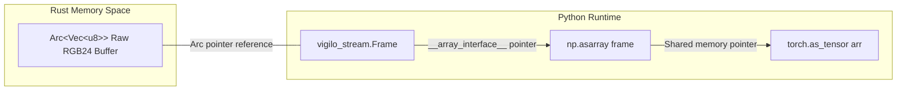

# Zero-copy memory

Zero-copy memory sharing is a core design feature of `vigilo-stream`. It allows Python code to read and manipulate high-resolution video frames allocated by the Rust backend without copying pixel data across the FFI boundary.

## The cost of memory copying

In standard Python bindings, passing a 1920x1080 RGB24 frame from native code to Python usually calls `PyBytes_FromStringAndSize` followed by `np.frombuffer`, copying ~6.2 MB of raw bytes.

At 30 frames per second:
- **Bandwidth consumed**: ~186 MB/s of unnecessary RAM copies.
- **CPU cache thrashing**: Evicts L1/L2 cache lines needed by neural inference.
- **Garbage collection overhead**: Allocating and freeing dozens of large byte objects per second triggers Python GC pauses.

## How vigilo-stream achieves zero copy

`vigilo-stream` implements the Python buffer protocol and the NumPy `__array_interface__` directly on the Rust `PyFrame` class.



When you call `frame = pipe.poll_frame()`, the underlying image buffer is held in an atomic `Arc<Vec<u8>>` inside Rust.

### Direct NumPy interop

```python
import numpy as np
import vigilo_stream

frame = pipe.poll_frame()

# Expose Rust memory directly to NumPy
arr = np.asarray(frame)

# Verify that both objects point to the exact same memory address
rust_ptr = frame.__array_interface__["data"][0]
numpy_ptr = arr.__array_interface__["data"][0]
assert rust_ptr == numpy_ptr

print(f"Direct pointer: {hex(numpy_ptr)}")
print(f"Shape: {arr.shape}")  # (height, width, 3)
print(f"Dtype: {arr.dtype}")  # uint8
```

### Direct PyTorch interop

Because NumPy shares the buffer, PyTorch can also create a tensor over the same memory without copying:

```python
import torch

# Zero-copy tensor wrapping
tensor = torch.as_tensor(arr)
assert tensor.data_ptr() == numpy_ptr
```

### Python memoryview support

`Frame` also supports Python's built-in `memoryview()` protocol:

```python
mv = memoryview(frame)
print(f"Length in bytes: {len(mv)}")  # width * height * 3
```

## Buffer lifetime and safety

The underlying memory is owned by Rust's `Arc<Vec<u8>>`. As long as either the `Frame`, the NumPy array, or the PyTorch tensor is alive in Python, the reference count remains greater than zero. Rust will not deallocate the frame buffer until all Python references are dropped.
