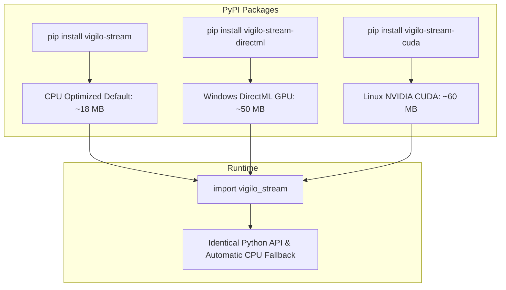

# Hardware & GPU acceleration

This page outlines the execution provider architecture, comparing the default CPU-optimized build with discrete GPU acceleration across different operating systems.

## Current build: CPU-optimized

The default `vigilo-stream` PyPI package is built and optimized for CPU execution:

- **Package size**: ~18 MB wheel.
- **Dependencies**: No external GPU runtimes, CUDA drivers, or DirectX 12 DLLs required.
- **Latency**: ~12 to 18 ms face detection p50 on modern x86_64 and Apple Silicon processors.
- **Compatibility**: Runs out of the box on Windows, Ubuntu, Debian, macOS (arm64 and x86_64), and containerized CI environments.

For standard proctoring at 30 fps, the CPU-optimized build comfortably meets real-time latency budgets.

---

## Discrete GPU acceleration

Discrete GPU acceleration offloads tensor computations to dedicated hardware accelerators, providing lower latency, higher frame throughput, and reduced CPU utilization.

### OS-specific acceleration targets

Different operating systems require different acceleration backends. Bundling a Windows-specific GPU backend into Linux or macOS packages is ineffective and unnecessarily increases binary size:

| Platform | Recommended execution provider | Hardware support | Prerequisites |
| :--- | :--- | :--- | :--- |
| **Windows** | **DirectML** (DirectX 12) | NVIDIA, AMD Radeon, Intel Arc | Windows 10/11, DirectX 12 GPU |
| **macOS** | **CoreML** (Metal / ANE) | Apple Silicon (M1/M2/M3/M4) | macOS 12+, Apple Silicon |
| **Linux** | **CUDA / TensorRT** | NVIDIA discrete GPUs | NVIDIA driver, CUDA toolkit |

### DirectML on Windows

The `gpu-directml` branch in the desktop engine uses Microsoft DirectML. DirectML is built on DirectX 12, allowing it to accelerate neural networks across all major GPU vendors on Windows (NVIDIA GeForce, AMD Radeon, and Intel Arc) without requiring proprietary CUDA installations.

#### DirectML configuration rules

When using DirectML with ONNX Runtime, specific session options are mandatory:

```rust
// DirectML requires single-thread execution and disables memory-pattern planning
let builder = Session::builder()?
    .with_parallel_execution(false)?
    .with_memory_pattern(false)?
    .with_execution_providers([
        ep::DirectML::default().build().error_on_failure()
    ])?;
```

- **Dynamic axis pinning**: DirectML partitions subgraphs at session initialization. Any dynamic dimension (e.g. batch size) must be pinned ahead of time, or the subgraph silently falls back to CPU execution.
- **Error on failure**: DirectML is configured with `error_on_failure()` so that if an unsupported device or driver is encountered, the system detects the failure explicitly and falls back gracefully to the CPU provider.

---

## Packaging strategy: CPU vs GPU

Bundling GPU backends directly into a single universal wheel introduces significant trade-offs:
- DirectML adds `DirectML.dll` (~18 MB) plus larger ONNX Runtime static libraries, nearly tripling the wheel size to ~50 MB.
- Linux and macOS wheels cannot use DirectML, making those extra megabytes dead weight on non-Windows machines.

### Proposed packaging options



### Option 1: Dual PyPI package (Recommended)
- **`vigilo-stream`**: Default lightweight CPU build (cross-platform, ~18 MB).
- **`vigilo-stream-directml`**: Windows-specific wheel containing DirectML GPU acceleration with automatic CPU fallback if no DirectX 12 hardware is found.
- Both packages share the exact same module name (`vigilo_stream`) so application code remains unchanged.

This approach mirrors the packaging model used by `onnxruntime` vs `onnxruntime-directml` and `torch+cpu` vs `torch+cu121`.

### Option 2: Feature-gated source builds
Users who want GPU acceleration can compile from source with Cargo feature flags:

```bash
# Windows DirectML build
maturin develop --features directml

# Linux CUDA build
maturin develop --features cuda
```
